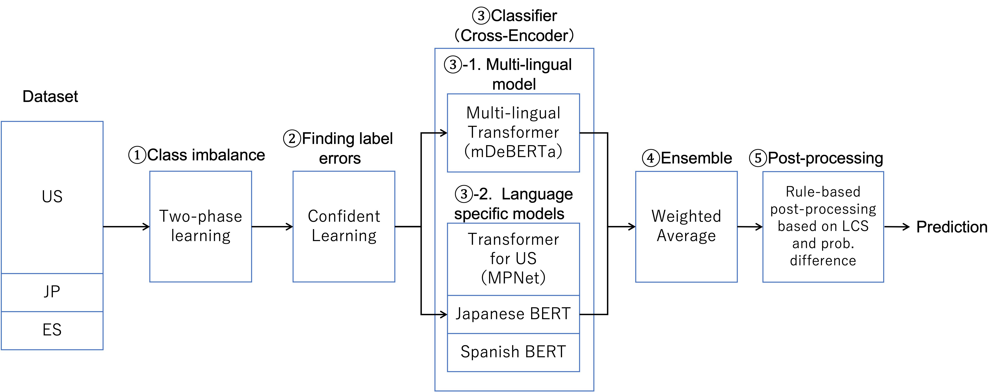

# KDD-Cup-2022-Amazon

This repository is the team NTT-DOCOMO-LABS-GREEN's solution for [Amazon KDD Cup 2022 - ESCI Challenge](https://www.aicrowd.com/challenges/esci-challenge-for-improving-product-search/) Task 3. 
We achieved 9th place in KDD Cup 2022.
Overview of our solution is shown as follows. 

#### General solution
* Two-phase learning was used to cope with the class imbalance problem.
* Models were trained by deleting noisy labels using [cleanlab](https://cleanlab.ai/)
* We integrated a multi-lingual model ([mDeBERTa](https://huggingface.co/microsoft/mdeberta-v3-base)) and language specific models ([US](https://huggingface.co/docs/transformers/model_doc/mpnet), [JP](https://huggingface.co/cl-tohoku/bert-base-japanese-v2), [ES](https://huggingface.co/dccuchile/bert-base-spanish-wwm-uncased)) by applying weighted average ensemble.
* Rule-based Post-processing based on findings of EDA.

More details are described in [our blog](https://nttdocomo-developers.jp/entry/2022/08/24/120000) (in Japanese only).

日本語での解説は[こちらの記事](https://nttdocomo-developers.jp/entry/2022/08/24/120000)を参考にしてください。